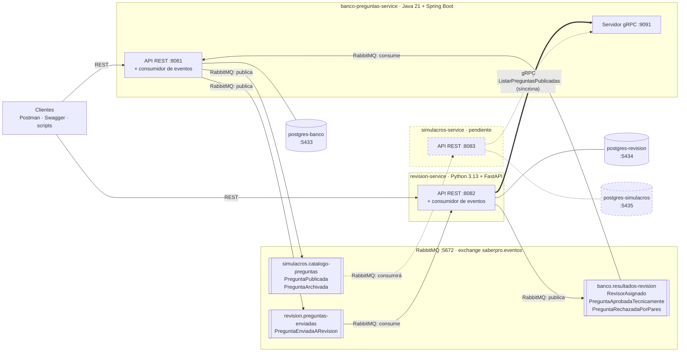
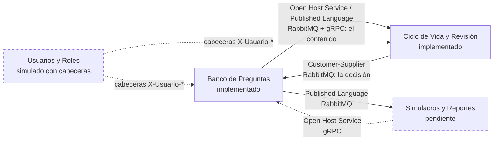

# Arquitectura del sistema

## 1. Diagrama general

Los dos microservicios, sus bases de datos, RabbitMQ y el tercer servicio que
queda pendiente. Cada flecha dice con qué tecnología viaja.

Lo que conviene mirar en el diagrama:

- **Cada servicio tiene su propia base de datos** y nadie toca la del otro. Los
  datos que revisión necesita del banco los pide por gRPC y guarda una copia.
- **Los dos sentidos de la asincronía.** El banco avisa a revisión con
  `PreguntaEnviadaARevision`, y revisión le contesta con tres eventos por la
  cola `banco.resultados-revision`.
- **La única llamada síncrona entre servicios es gRPC.** Ningún servicio llama
  al REST del otro.
- **Cada cola nombra los eventos que lleva.** Las flechas dicen quién publica y
  quién consume; el contrato de cada evento está en [`eventos.md`](eventos.md).
- **La cola del tercer servicio ya existe.** Guarda los eventos
  `PreguntaPublicada` y `PreguntaArchivada` que todavía no ha consumido nadie.
  Cuando el tercer microservicio se conecte, los encontrará ahí.

## 2. Context map

| Relación | Patrón DDD | Tecnología | Por qué |
|---|---|---|---|
| Revisión → Banco (decisión) | **Customer-Supplier**, como en el Taller 1 | RabbitMQ (`RevisorAsignado`, `PreguntaAprobadaTecnicamente`, `PreguntaRechazadaPorPares`) | Revisión es el proveedor: decide si una pregunta queda aprobada o rechazada. El banco es el cliente que necesita ese resultado para reflejar el estado de la pregunta |
| Banco → Revisión (contenido) | Open Host Service / Published Language | RabbitMQ (`PreguntaEnviadaARevision`) y gRPC (`ObtenerPregunta`) | El banco anuncia cuándo empieza una revisión y sirve el contenido por un contrato estable, pensado para cualquier consumidor; revisión se adapta a él |
| Banco → Simulacros | Published Language | RabbitMQ (`PreguntaPublicada`, `PreguntaArchivada`) | El catálogo se arma escuchando, sin preguntar |
| Simulacros → Banco | Open Host Service | gRPC (`ListarPreguntasPublicadas`) | El banco ofrece una operación pensada para cualquier consumidor |
| Usuarios y Roles → los dos | — | Cabeceras `X-Usuario-Id` y `X-Usuario-Rol` | Ese contexto no se implementa; se simula en el borde de cada servicio |

Banco y Revisión dependen el uno del otro, pero en flujos distintos, y cada flujo
tiene su propio proveedor. En el **flujo de decisión**, que es el que modela el
Taller 1, el proveedor es Revisión: el banco consume sus tres eventos y ajusta el
estado de la pregunta. En el **flujo de contenido** el proveedor es el banco: es
quien define el evento `PreguntaEnviadaARevision` y el contrato gRPC, y revisión
los consume tal como vienen.

## 3. Las 4 capas

Los dos servicios tienen la misma estructura, con los nombres en el idioma de
cada uno.

| Capa | Qué va aquí | Qué **no** puede conocer |
|---|---|---|
| `dominio` | Los agregados, los Value Objects, los servicios de dominio, los eventos y las interfaces de repositorio | Nada: ni framework, ni base de datos, ni broker, ni gRPC |
| `aplicacion` | Los casos de uso, los puertos de salida y los DTO | Infraestructura e interfaces |
| `infraestructura` | JPA o SQLAlchemy, RabbitMQ, gRPC y la configuración | — |
| `interfaces` | La API REST, los esquemas de entrada y salida y el manejo de errores | — |

La regla es una sola: **las dependencias apuntan hacia el dominio**. El dominio
declara qué necesita (por ejemplo `PreguntaRepository`) y la infraestructura lo
implementa.

### Cómo se verifica

No es una regla escrita en un documento: falla el build.

**En Java, 3 reglas de ArchUnit** (`ArquitecturaTest`):

1. Las capas van en orden: nadie accede a `interfaces`; a `infraestructura` solo
   desde `interfaces`; a `aplicacion` solo desde `interfaces` e
   `infraestructura`.
2. El dominio no depende de `org.springframework`, `jakarta.persistence`,
   `org.springframework.amqp`, `io.grpc` ni `com.fasterxml.jackson`.
3. La aplicación no depende de `infraestructura` ni de `interfaces`.

**En Python, 2 contratos de import-linter** (`pyproject.toml`):

1. Las capas van en orden: `interfaces` → `infraestructura` → `aplicacion` →
   `dominio`.
2. El dominio no importa `fastapi`, `sqlalchemy`, `pydantic`, `aio_pika` ni
   `grpc`.

En Python el contrato de capas está **apilado** y no con `interfaces` e
`infraestructura` como hermanas independientes. La razón es concreta:
`app/interfaces/api/dependencias.py` es el punto de composición del servicio, el
sitio donde se cablean los casos de uso con las implementaciones reales, y por
tanto importa de `infraestructura` a propósito. Declararlas hermanas convertiría
ese cableado en una violación. Lo que el contrato sí impide es lo que importa:
que `aplicacion` mire hacia afuera y que el `dominio` dependa de cualquier cosa.
Las 3 reglas de ArchUnit expresan exactamente lo mismo en Java.

## 4. Correspondencia con el modelo DDD del Taller 1

### `banco-preguntas-service`

| Elemento | Concepto DDD | Dónde está |
|---|---|---|
| `Pregunta` | **Aggregate Root** | `dominio/modelo/Pregunta.java` |
| `Opcion`, `Justificacion`, `Bibliografia`, `Competencia`, `Tema`, `Subtema` | Value Objects | `dominio/modelo/` |
| `EstadoPregunta`, `NivelDificultad` | Value Objects (enum) | `dominio/modelo/` |
| `ContenidoPregunta` | Value Object | `dominio/modelo/` |
| `CambioEstado` | Value Object (historial) | `dominio/modelo/` |
| `ValidadorEstructural` | **Domain Service** | `dominio/servicios/` |
| `PreguntaEnviadaARevision`, `PreguntaPublicada`, `PreguntaArchivada` | **Domain Events** | `dominio/eventos/` |
| `PreguntaRepository` | Repository | `dominio/repositorios/` |

Garantiza las **invariantes 1 a 8**: las cuatro de contenido las comprueba
`ValidadorEstructural`; la 5 y la 6 el propio agregado al cambiar de estado; la 7
al editar; y la 8 por ausencia, porque no existe ninguna operación de borrado.

De la invariante 3, el banco comprueba la longitud mínima y que las opciones no
se repitan. La otra mitad, que las opciones tengan una **estructura gramatical
coherente con la pregunta directa**, no se puede comprobar de forma fiable sin
análisis de lenguaje natural: la juzga el revisor con el criterio
`COHERENCIA_GRAMATICAL` del formato de evaluación, en el `revision-service`.

### `revision-service`

| Elemento | Concepto DDD | Dónde está |
|---|---|---|
| `Revision` | **Aggregate Root** | `dominio/modelo/revision.py` |
| `FormatoEvaluacion`, `Observacion` | Value Objects | `dominio/modelo/` |
| `EstadoRevision`, `Decision`, `CriterioEvaluacion`, `NivelDificultad` | Value Objects (enum) | `dominio/modelo/enums.py` |
| `SnapshotPregunta`, `OpcionSnapshot` | Value Objects | `dominio/modelo/snapshot_pregunta.py` |
| `RevisorDisponible` | Proyección local | `dominio/modelo/revisor_disponible.py` |
| `AsignadorRevisor` | **Domain Service** | `dominio/servicios/` |
| `RevisorAsignado`, `PreguntaAprobadaTecnicamente`, `PreguntaRechazadaPorPares` | **Domain Events** | `dominio/eventos/eventos.py` |
| `RevisionRepository`, `RevisorRepository` | Repositories | `dominio/repositorios/` |

Garantiza las **invariantes 9 a 11**: la 9 en el constructor, que no deja
construir una `Revision` sin revisor; la 10 y la 11 al decidir. Como la 10 exige
el formato completo, también garantiza la parte gramatical de la **invariante 3**:
ninguna pregunta se aprueba sin que el revisor haya puntuado
`COHERENCIA_GRAMATICAL`.

### Qué se agregó o cambió respecto al Taller 1

El Taller 1 define 6 Value Objects en su tabla 2.6 (`Justificación`, `Opción`,
`Competencia`, `EstadoPregunta`, `NivelDificultad` y `FormatoEvaluación`) y su
diagrama de arquitectura nombra además `Obs_VO` y `Estado_VO`, que son
`Observacion` y `EstadoRevision`. Todos están implementados. Los demás Value
Objects del código son los que se explican aquí.

| Elemento | Por qué |
|---|---|
| **Los 8 estados del lenguaje ubicuo** | La pregunta pasa por `BORRADOR`, `EN_CONSTRUCCION`, `PENDIENTE_REVISION`, `EN_REVISION`, `APROBADA`, `RECHAZADA`, `PUBLICADA` y `ARCHIVADA`. El Taller 1 no define en qué se diferencian Borrador y En construcción: se decidió que `BORRADOR` es la pregunta recién creada y `EN_CONSTRUCCION` la que el autor ya está trabajando. Está en ADR 2 |
| **4 opciones por pregunta** | 3 distractores y 1 correcta (invariante 1). El Taller 1 hablaba de 4 distractores y 1 correcta; se corrigió a 4 opciones en total |
| **Criterio `COHERENCIA_GRAMATICAL`** | Es la parte de la invariante 3 que no puede comprobar una máquina; la juzga el revisor |
| **`Bibliografia`, `Tema` y `Subtema`** | El glosario del Taller 1 los nombra como partes de la Pregunta (términos 3, 26 y 27) pero no como Value Objects. Son valores sin identidad con reglas propias al construirse: `Tema` y `Subtema` no pueden estar vacíos, y `Bibliografia` descarta las referencias en blanco y recorta espacios. Por eso se modelaron como Value Objects en lugar de dejarlos como texto suelto |
| **`Decision` y `CriterioEvaluacion`** | Hacen explícito lo que el Taller 1 describe en prosa: el revisor decide aprobar o rechazar, y el formato de evaluación tiene criterios fijos. Como enumeraciones, un valor inventado no puede llegar al agregado |
| **`NivelDificultad` en revisión** | Una copia del enum del banco, porque el snapshot la necesita. No se comparte código entre servicios (ADR 5) |
| Evento **`RevisorAsignado`** | El Taller 1 no lo tenía, y sin él el banco no puede saber si la revisión empezó de verdad. Si no hay revisores disponibles no se crea ninguna revisión, y la pregunta debe quedarse en `PENDIENTE_REVISION` en vez de pasar a `EN_REVISION`. Es lo que hace cumplible la invariante 9 entre dos contextos separados |
| **`SnapshotPregunta`** | Revisión guarda una copia del contenido que va a evaluar, obtenida por gRPC. Así el revisor juzga algo estable: una edición posterior no cambia lo que ya evaluó, y revisión no tiene que consultar al banco en cada pantalla |
| **`RevisorDisponible`** | El Bounded Context de Usuarios y Roles no se implementa, así que revisión mantiene su propia lista de revisores |
| **`CambioEstado`** y el historial | Trazabilidad: quién movió la pregunta, cuándo y por qué |
| **`ContenidoPregunta`** | Agrupa todo lo que el autor puede escribir, para poder validarlo antes de que el agregado exista y para que crear y editar compartan la misma validación |

Los dos primeros están explicados en [`decisiones.md`](decisiones.md) como ADR 1
y ADR 6.
