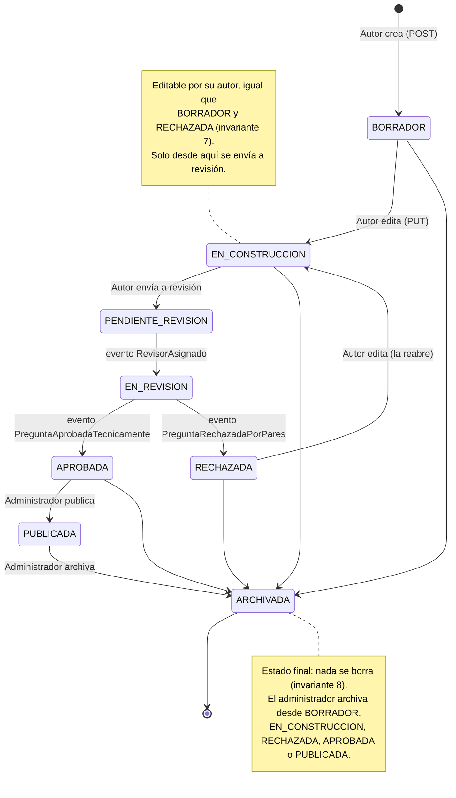

# Ciclo de vida de una pregunta

Cómo avanza una pregunta desde que el autor la redacta hasta que queda disponible
para los simulacros: primero como **máquina de estados** del agregado `Pregunta`,
y después como **proceso de negocio**, con los roles que intervienen y las
decisiones que se toman.

Los estados son los 8 del lenguaje ubicuo del Taller 1. Por qué existen
`EN_CONSTRUCCION` y `RECHAZADA` está explicado en
[`decisiones.md`](decisiones.md), ADR 2.

## 1. Máquina de estados

| Desde | Hacia | Quién o qué la provoca | Cómo |
|---|---|---|---|
| — | `BORRADOR` | Autor | `POST /api/v1/preguntas`, si cumple las invariantes 1 a 4 |
| `BORRADOR` | `EN_CONSTRUCCION` | Autor | `PUT /api/v1/preguntas/{id}` (la primera edición) |
| `EN_CONSTRUCCION` | `PENDIENTE_REVISION` | Autor | `POST /{id}/enviar-a-revision`; publica `PreguntaEnviadaARevision` |
| `PENDIENTE_REVISION` | `EN_REVISION` | revision-service | Evento `RevisorAsignado` |
| `EN_REVISION` | `APROBADA` | revision-service | Evento `PreguntaAprobadaTecnicamente` |
| `EN_REVISION` | `RECHAZADA` | revision-service | Evento `PreguntaRechazadaPorPares`, con las observaciones |
| `RECHAZADA` | `EN_CONSTRUCCION` | Autor | `PUT /api/v1/preguntas/{id}`: la reabre para corregirla |
| `APROBADA` | `PUBLICADA` | Administrador | `POST /{id}/publicar`; revalida (invariante 5) y publica `PreguntaPublicada` |
| `BORRADOR`, `EN_CONSTRUCCION`, `RECHAZADA`, `APROBADA`, `PUBLICADA` | `ARCHIVADA` | Administrador | `POST /{id}/archivar`; publica `PreguntaArchivada` |

Cualquier otra transición se rechaza con **409** (invariante 6). Las tres
transiciones del medio no las pide nadie por REST: las provocan los eventos del
otro microservicio. La tabla vive en un solo sitio del código,
`EstadoPregunta`, y la base de datos la refuerza con una restricción `CHECK`.

## 2. Proceso de negocio

El mismo recorrido visto como proceso, al estilo BPMN: cada color es un rol (un
carril), los rombos son decisiones y los círculos marcan el inicio, el fin y la
espera. Los dos sistemas son los dos microservicios; los mensajes entre ellos
viajan por RabbitMQ y gRPC, como se ve en [`flujo-e2e.md`](flujo-e2e.md).

```mermaid
flowchart TB
    subgraph leyenda["Roles"]
        direction LR
        LA["Autor"]:::autor
        LB["Banco de Preguntas"]:::banco
        LR2["Ciclo de Vida y Revisión"]:::revision
        LV["Revisor"]:::revisor
        LD["Administrador"]:::admin
    end

    I(("Inicio")):::evento --> A1["Autor: redacta la pregunta<br/>contexto, pregunta directa, 4 opciones, justificación"]:::autor
    A1 --> B1["Banco: valida la estructura<br/>(invariantes 1 a 4)"]:::banco
    B1 --> G1{"¿Cumple?"}:::decision
    G1 -- No: 400 con los errores --> A2["Autor: corrige el contenido"]:::autor
    A2 --> B1
    G1 -- Sí --> B2["Banco: la guarda en BORRADOR"]:::banco
    B2 --> A3["Autor: trabaja la pregunta (la edita)"]:::autor
    A3 --> B3["Banco: EN_CONSTRUCCION"]:::banco
    B3 --> A4["Autor: la envía a revisión"]:::autor
    A4 --> B4["Banco: revalida, PENDIENTE_REVISION<br/>y publica PreguntaEnviadaARevision"]:::banco
    B4 --> R1["Revisión: trae la pregunta por gRPC<br/>y guarda el snapshot"]:::revision
    R1 --> G2{"¿Hay revisor<br/>disponible?"}:::decision
    G2 -- No --> E1(("El evento espera en la DLQ;<br/>la pregunta sigue en PENDIENTE_REVISION")):::evento
    G2 -- Sí --> R2["Revisión: asigna revisor<br/>y publica RevisorAsignado"]:::revision
    R2 --> B5["Banco: EN_REVISION"]:::banco
    B5 --> V1["Revisor: diligencia el formato (6 criterios,<br/>incluida la coherencia gramatical) y observa"]:::revisor
    V1 --> G3{"¿Formato completo?<br/>(invariante 10)"}:::decision
    G3 -- No --> V1
    G3 -- Sí --> G4{"Decisión del revisor"}:::decision
    G4 -- Aprobar --> G5{"¿Promedio ≥ 3.0?"}:::decision
    G5 -- No: debe rechazar --> G6
    G4 -- Rechazar --> G6{"¿Hay al menos una<br/>observación? (invariante 11)"}:::decision
    G6 -- No --> V1
    G6 -- Sí --> R4["Revisión: publica<br/>PreguntaRechazadaPorPares"]:::revision
    R4 --> B7["Banco: RECHAZADA<br/>con las observaciones"]:::banco
    B7 --> A5["Autor: lee las observaciones<br/>y corrige (la reabre)"]:::autor
    A5 --> B3
    G5 -- Sí --> R3["Revisión: publica<br/>PreguntaAprobadaTecnicamente"]:::revision
    R3 --> B6["Banco: APROBADA"]:::banco
    B6 --> D1["Administrador: la publica"]:::admin
    D1 --> B8["Banco: revalida (invariante 5), PUBLICADA<br/>y publica PreguntaPublicada"]:::banco
    B8 --> F((("Fin: disponible<br/>para los simulacros"))):::evento

    classDef autor fill:#1f4f82,stroke:#79b8ff,color:#ffffff
    classDef banco fill:#1f5e3b,stroke:#56d364,color:#ffffff
    classDef revision fill:#6b4d12,stroke:#e3b341,color:#ffffff
    classDef revisor fill:#5a2d75,stroke:#d2a8ff,color:#ffffff
    classDef admin fill:#7a2331,stroke:#ff7b72,color:#ffffff
    classDef decision fill:#2d333b,stroke:#adbac7,color:#ffffff
    classDef evento fill:#2d333b,stroke:#adbac7,color:#ffffff
```

Las decisiones del proceso son reglas del dominio, no pasos opcionales:

- **¿Cumple?** Lo decide el `ValidadorEstructural`: 4 opciones con una sola
  correcta, nada de «todas/ninguna de las anteriores», longitud mínima, opciones
  distintas, contexto y pregunta directa (invariantes 1 a 4).
- **¿Hay revisor disponible?** Lo decide el `AsignadorRevisor`. Si no hay
  ninguno, no se crea la revisión (invariante 9) y el evento queda en la DLQ
  hasta que se pueda reprocesar.
- **¿Formato completo?** Los 6 criterios, incluida la coherencia gramatical, que
  es la parte de la invariante 3 que juzga una persona (invariante 10).
- **¿Promedio ≥ 3.0?** Por debajo del mínimo no se puede aprobar; la única
  decisión posible es rechazar con observaciones (invariante 10).
- **¿Hay al menos una observación?** Un rechazo sin observaciones no le dice al
  autor qué corregir (invariante 11).
