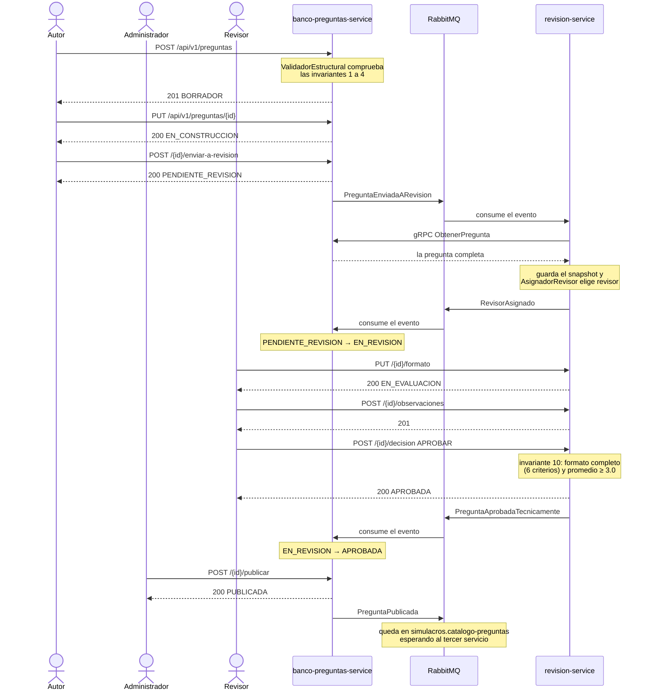
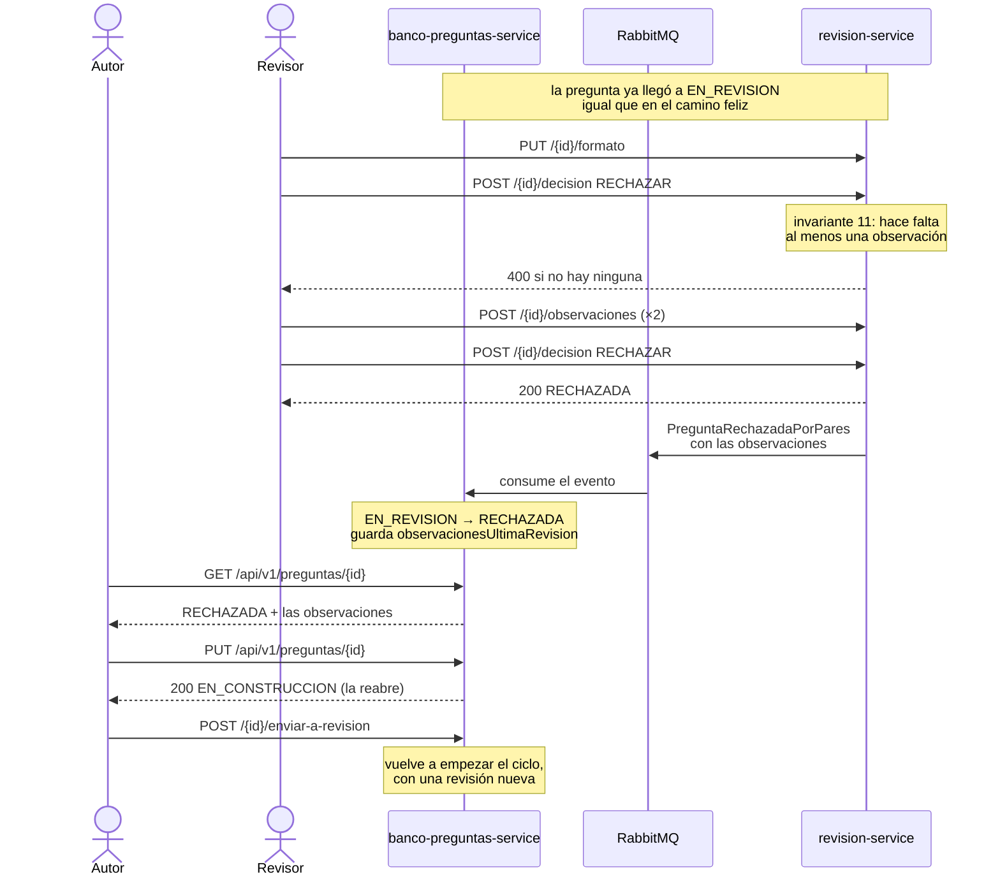

# Flujo de punta a punta

Cómo viaja una pregunta entre los dos microservicios. Los dos diagramas están en
`docs/` y se pueden ver también ejecutando el sistema y corriendo
`prueba-e2e.ps1`, que recorre exactamente estos dos caminos.

## 1. Camino feliz: de BORRADOR a PUBLICADA

Lo importante de este diagrama:

- **Una pregunta recién creada no se envía directamente.** Primero el autor la
  edita y pasa a `EN_CONSTRUCCION`; solo desde ahí se envía (invariante 6).
- **Entre `PENDIENTE_REVISION` y `EN_REVISION` el autor no hace nada.** El cambio
  lo provocan un evento, una llamada gRPC y otro evento. En la práctica tarda
  un par de segundos.
- **La llamada gRPC ocurre fuera de la transacción de base de datos.** Una
  llamada de red no debe mantener abierta una transacción.
- **Los eventos se publican después de confirmar la transacción.** Nunca se
  anuncia un cambio que podría deshacerse.
- **El estado lo cambia siempre el agregado**, comprobando su máquina de estados.
  Un evento que pida una transición imposible se rechaza.

## 2. Camino de rechazo: el autor la reabre y la reenvía

**Una pregunta rechazada no se descarta.** Queda en `RECHAZADA` con las
observaciones del revisor, y el autor la reabre al editarla: pasa a
`EN_CONSTRUCCION` y desde ahí la reenvía. Está explicado en
[`decisiones.md`](decisiones.md) como ADR 2.

## 3. Qué pasa cuando algo falla

Si al procesar un evento ocurre cualquier error —el JSON no se entiende, la
pregunta no existe en el banco, no hay revisores disponibles, la base de datos no
responde— el consumidor registra el motivo en el log y manda el mensaje a la
**DLQ** (*dead-letter queue*) de su cola. No hay reintentos: reintentar en el
momento solo retrasaría el problema, y reencolar el mensaje produciría un bucle
a toda velocidad.

Lo importante es que **el evento no se pierde**. Queda guardado en la DLQ, se ve
en la consola de RabbitMQ (<http://localhost:15672>) y se puede volver a publicar
cuando la causa esté resuelta. Cada cola de negocio tiene su `<cola>.dlq` a
través del exchange `saberpro.eventos.dlx`.

Los detalles de las colas y de la idempotencia están en
[`eventos.md`](eventos.md).
